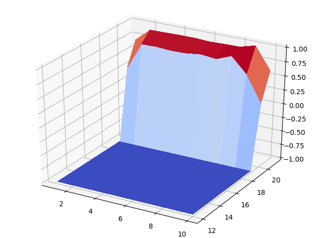

# Blackjack

## Theory
* Monte Carlo estimation of value function given a policy pi.
* Episodes are generated by following the policy. Once the state space is explored, returns are computed for every state from the trajectories.
* For every state, the value function is estimated as the average of the returns observed.
* This is true as the episodes are obtained following the policy pi and hence returns are sampled according to it.

## Trial
```
$ python main.py
```
Estimates the value function ( 500,000 iterations ) and plots it.

## Plots
Plot of V(s) when the player has **no usable aces**


Plot of V(s) when the player has a **usable ace**

